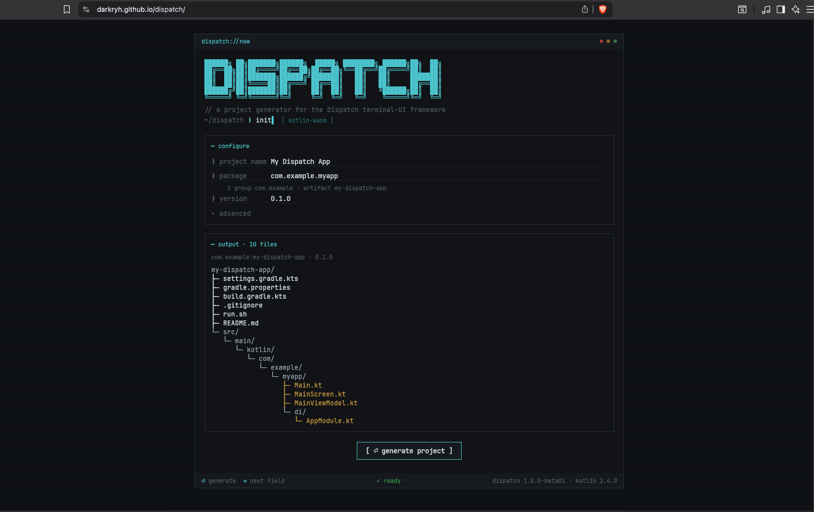

# Dispatch

> A declarative terminal UI framework for Kotlin, built on the Jetpack Compose runtime.

[](https://central.sonatype.com/namespace/io.github.darkryh.dispatch)
[](LICENSE)

Dispatch lets you build rich, interactive command-line apps the same way you build Compose UIs —
with `@Composable` functions, state, layout containers, navigation, and view models — rendered to a
real terminal, flicker-free.

If you know Compose on Android or desktop, you already know Dispatch: state drives recomposition,
layout is a tree of measure/place nodes, and a modifier chain configures each node. The target is
different — a terminal — so Dispatch is built around what a terminal can and cannot do.

## Features

- **The Compose programming model** — `Column`, `Row`, `Box`, lazy lists, `remember`, state and
  recomposition, `CompositionLocal`s, and a familiar modifier system, targeting the terminal.
- **A full widget set** — text, buttons, inputs, selectable and multi-select lists, tables, grids,
  trees, panels, surfaces, dividers, progress bars, spinners, checklists, diffs, and a command
  palette.
- **Flicker-free rendering** — content is painted print-once / append-only; only what changes is
  repainted, and every frame is buffered and flushed atomically.
- **Idle hibernation** — after a spell with no input, the app throttles its frame rate and releases
  rebuildable caches, then wakes instantly on the next key — without pausing your background work.
  On by default, fully configurable.
- **Typed navigation** — a serializable back stack with lifecycle-aware, view-model-scoped entries.
- **Architecture batteries included** — `ViewModel` and MVI base classes, a lifecycle registry,
  saved-state handles, and optional Koin dependency injection.
- **Optional modules** — in-app self-update (Homebrew, Scoop, APT, GitHub releases) and filesystem
  watching.

## Requirements

- JDK 21 or newer.
- Kotlin with Gradle and the Compose compiler plugin (Dispatch composables are compiled by the same
  plugin used for Compose).

## Create a new project

The recommended way to start is the **Dispatch Initializr** — a browser-based project generator that
scaffolds a complete, ready-to-run app. No install, no manual Gradle setup:

**[darkryh.github.io/dispatch](https://darkryh.github.io/dispatch/)**

[](https://darkryh.github.io/dispatch/)

Type a **project name**, **package**, and **version**, and the generator shows the exact file tree it
will produce — `build.gradle.kts`, a `run.sh` launcher, and a `src/` tree with `Main.kt`,
`MainScreen.kt`, `MainViewModel.kt`, and Koin DI in `di/AppModule.kt`. Press **generate project** to
download it as a zip, built entirely in your browser — there is no backend.

The result is a single screen wired with Koin dependency injection and an MVI view model — the
blessed starting pattern — with Kotlin, Gradle, the JVM toolchain, and the Dispatch version already
pinned for you. Nothing to configure by hand.

After unzipping, generate the Gradle wrapper once and run it:

```bash
gradle wrapper --gradle-version 9.6.1
./run.sh
```

The generated project ships a `run.sh` because a terminal UI needs a real TTY: `./gradlew run`
captures stdin/stdout and garbles the rendering, so `run.sh` builds a native launcher with
`installDist` and execs it directly.

Adding Dispatch to an existing project instead? Follow [Installation](#installation) below.

## Installation

To add Dispatch to an existing Gradle project by hand, add the Compose compiler plugin and the
Dispatch dependencies. The entry point lives in `dispatch-core`; `dispatch-widgets` brings the
widgets, layout, modifiers, theme, and view-model APIs with it.

```kotlin
// build.gradle.kts
plugins {
    kotlin("jvm") version "2.4.0"
    id("org.jetbrains.kotlin.plugin.compose") version "2.4.0"
}

dependencies {
    implementation("io.github.darkryh.dispatch:dispatch-core:1.0.0-beta03")
    implementation("io.github.darkryh.dispatch:dispatch-widgets:1.0.0-beta03")

    // Add as needed:
    implementation("io.github.darkryh.dispatch:dispatch-navigation:1.0.0-beta03")
    implementation("io.github.darkryh.dispatch:dispatch-koin:1.0.0-beta03")
}
```

All artifacts share the group `io.github.darkryh.dispatch` and the same version. See
[Modules](#modules) for the full list.

## Quick start

```kotlin
import io.github.darkryh.dispatch.layout.Column
import io.github.darkryh.dispatch.runtime.DispatchApplication
import io.github.darkryh.dispatch.runtime.ExitKeyBinding
import io.github.darkryh.dispatch.runtime.LocalTheme
import io.github.darkryh.dispatch.theme.DispatchTheme
import io.github.darkryh.dispatch.widget.Text
import androidx.compose.runtime.Composable

fun main(args: Array<String>) =
    DispatchApplication(args) {
        config {
            name = "hello"
            version = "1.0.0"
            theme = DispatchTheme.Dark
            exitKeys(ExitKeyBinding.ctrl("C"))
        }
        content { Hello() }
    }

@Composable
fun Hello() {
    val theme = LocalTheme.current
    Column {
        Text("Hello, Dispatch!", style = theme.primary)
        Text("Press Ctrl+C twice to quit.", style = theme.muted)
    }
}
```

Run it, and the two lines render in your terminal. Press Ctrl+C **twice within 1.5 s** to quit —
exit is double-press by default so a stray Ctrl+C can't kill a long-running session (set
`requireExitDoublePress = false` in `config` for single-press). The
[Getting started tutorial](docs/getting-started.md) builds this up step by step.

## Documentation

Full documentation lives in [`docs/`](docs/index.md):

- **[Getting started](docs/getting-started.md)** — build and run your first app.
- **[How-to guides](docs/how-to/index.md)** — navigation, view models, Koin DI, keyboard input,
  theming, self-update, and workspace watching.
- **[Reference](docs/reference/index.md)** — every widget, modifier, configuration option, and class.
- **[Explanation](docs/explanation/index.md)** — the render model, the module architecture, and why
  Dispatch builds on the Compose runtime.

## Modules

| Module | Responsibility |
|---|---|
| `dispatch-core` | App entry point (`DispatchApplication`), runtime engine, frame scheduling. |
| `dispatch-runtime` | Compose integration, composition, modifiers, constraints, focus, theme, input. |
| `dispatch-renderer` | ANSI output, atomic frame flushing, active-area management. |
| `dispatch-layout` | `Column` / `Row` / `Box` / flow layouts, alignment, arrangement. |
| `dispatch-widgets` | `Text`, lists, inputs, tables, panels, progress, command palette, and more. |
| `dispatch-navigation` | Typed back stack, nav entries, decorators, saved state. |
| `dispatch-viewmodel` | `ViewModel`, MVI base classes, `StateFlow` helpers. |
| `dispatch-lifecycle` | Lifecycle registry and states. |
| `dispatch-koin` | Koin DI integration and view-model factory. |
| `dispatch-workspace` | Filesystem watching for live-reload-style workflows. |
| `dispatch-update` | Update advisor (core). |
| `dispatch-update-github` / `-brew` / `-scoop` / `-apt` | Update providers per channel. |

## Building from source

```bash
./gradlew build                  # compile and test all modules
./build-execute.sh               # build and run the sample app (installDist + real-TTY launch)
./gradlew validateAll            # build, test, detekt, ktlint, coverage, module-boundary checks
```

The `dispatch-sample` module is a complete, offline showcase of layout, navigation, view models,
input, and DI. Requires JDK 21+.

## Contributing

Issues and pull requests are welcome at
[github.com/darkryh/dispatch](https://github.com/darkryh/dispatch). Dispatch is built around a strict
render model — see [The render model](docs/explanation/render-model.md) before changing rendering
behavior.

## License

Licensed under the [Apache License 2.0](LICENSE).

Copyright 2024 Darkryh.
